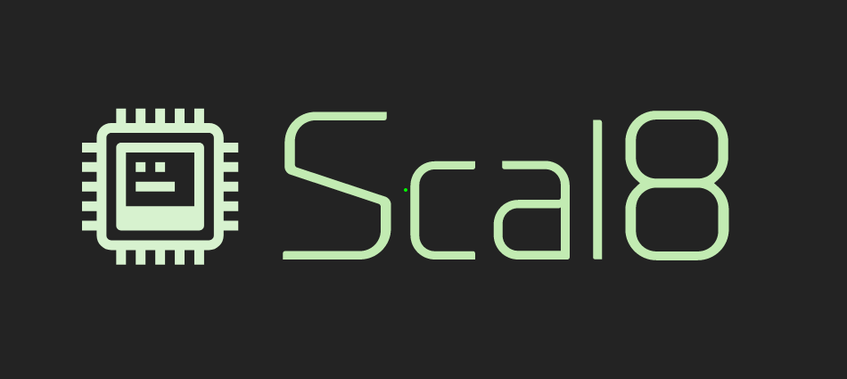

# What is this?

Scal8 is a [Chip8](https://en.wikipedia.org/wiki/CHIP-8) emulator written in Scala 2.12.

Currently, is semi-functional, but it's missing support for some opcodes and sound.

# What's the purpose of this project?

This project is purely didactic, and in fact, it's main purpose is for me to learn Scala, so it will be improved, changed, and refactored to apply new techniques and good practices as I continue my learning process. Right now, it looks kinda like modified Java, but it's my hope that, at some point, it'll be purely idiomatic Scala.

# Will you accept PRs for this project?

I would prefer issues, because the idea of this repo is for me to get my hands dirty in my learning. If you check this repo by any chance, see something that could be done better, and have the time and will to help, please open an issue with a small explanation :)

# How do I use it?

You'll need:

- Scala 2.12
- OpenJDK 11
- SBT 1.2.7

## Run

`sbt run "/PATH/TO/YOUR/ROM`

## Test

`sbt test`

## Package into a fat JAR

`sbt assembly`
`java -jar target/scala-2.12/scal8-assembly-1.0.jar /PATH/TO/YOUR/ROM`
